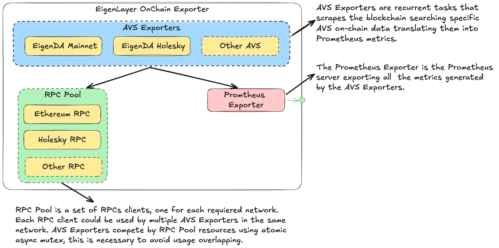

# EigenLayer AVS OnChain Exporter

EigenLayer AVS OnChain Exporter (EOE) is a tool designed to export on-chain data from various Active Validator Set (AVS) services within the EigenLayer ecosystem as Prometheus metrics.

## Features

### Supported AVSs and Prometheus metrics

#### EigenDA

For EigenDA, Holeksy and Mainnet are supported and exposes the following metrics:

- `eoe_eigenda_exporter_latest_block{network="<network>"}`: Latest block number that the EigenDA exporter of the specific network has processed.
- `eoe_eigenda_onchain_batches_total{network="<network>"}`: Total number of onchain batches that the EigenDA exporter of the specific network has processed. This is a counter that increments with each block and resets to 0 if the exporter is restarted.
- `eoe_eigenda_onchain_batches{operator="<operator>", network="<network>", status="<status>"}`: Number of onchain batches missed by an operator in the specific network. For now the only status is `missed`.
- `eoe_eigenda_onchain_quorum_status{operator="<operator>", network="<network>", quorum="<quorum>"}`: The status of the operator in the specific network and quorum. The value could be 1 if the operator is in quorum, 0 if the operator is not in quorum.

> Due this exporter could be tracking operators that are already running before the exporter is deployed, the `eoe_eigenda_onchain_quorum_status` initial value could be configured by setting the `operators[i].eigenDAConfig.quorums[j]` to `true` if the operator is in quorum at exporter start.

## Installation

There are two options for installing the EigenLayer AVS OnChain Exporter:

### Option 1: Building the Docker Image

1. Ensure you have Docker installed on your system.
2. Clone the repository:

   ```shell
   git clone https://github.com/NethermindEth/eigenlayer-onchain-exporter.git
   cd eigenda-blob-scrapper
   ```

3. Build the Docker image:

   ```shell
   docker build -t eigenlayer-avs-exporter .
   ```

4. Run the container:

   ```shell
   docker run \
      -p 8080:8080 \
      -v $(pwd)/config.yml:/config.yml \
      eigenlayer-avs-exporter
   ```

### Option 2: Building the Go Binary Directly

1. Ensure you have Go 1.23 or later installed on your system.
2. Clone the repository:

   ```shell
   git clone https://github.com/NethermindEth/eigenlayer-onchain-exporter.git
   cd eigenda-blob-scrapper
   ```

3. Build the binary:

   ```shell
   go build -o eigenlayer-avs-exporter
   ```

4. Run the binary:

   ```shell
   ./eigenlayer-avs-exporter --config config.yml run
   ```

Choose the installation method that best suits your needs and environment.

## Usage

Run the `eoe --help` command to see all the command options.

```shell
$ ./bin/eoe --help
EigenLayer On-chain Exporter (eoe) exposes Prometheus metrics about EigenLayer's Node Operator.

Usage:
  eoe [command]

Available Commands:
  completion  Generate the autocompletion script for the specified shell
  help        Help about any command
  run         Run the application

Flags:
  -c, --config string   path to config file (default "config.yml")
  -h, --help            help for eoe

Use "eoe [command] --help" for more information about a command.
```

## Configuration

The application uses a YAML configuration file. Here's an example of the `config.yml`:

```yaml
operators:
  - name: nethermind
    address: 0x57b6FdEF3A23B81547df68F44e5524b987755c99
    blsPublicKey: ["8888183187486914528692107799849671390221086122063975348075796070706039667533", "1162660161480410110225128994312394399428655142287492115882227161635275660953"]
    avsEnvs:
      - eigenda-holesky
    eigenDAConfig:
      quorums:
        - 0: false
  - name: nethermind
    address: 0x110af279aAFfB0d182697d7fC87653838AA5945e
    blsPublicKey: ["2358328128321302874738169219641985530311496023056707902743599195833986584402", "20423525555617668586476030951095516580576618542850420469015501514067149320880"]
    avsEnvs:
      - eigenda-mainnet
    eigenDAConfig:
      quorums:
        - 0: true
rpcs:
  - holesky: https://ethereum-holesky-rpc.publicnode.com
  - mainnet: https://ethereum-rpc.publicnode.com
```

## Structure Overview



## Contributing

Contributions are welcome! Please feel free to submit a Pull Request.
